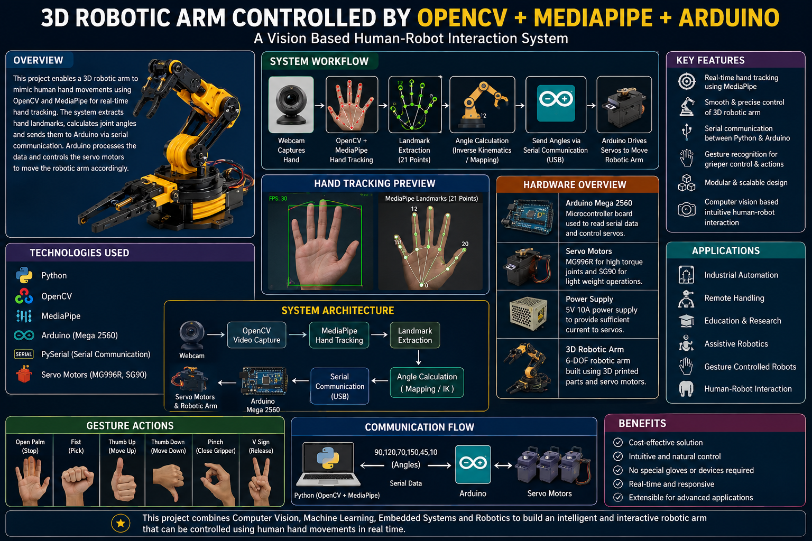

# 🦾 3D Robotic Arm Controlled by OpenCV + MediaPipe + Arduino

## Project Development Roadmap

## 

# 🎯 Project Goal

Build a real-time vision-based robotic arm control system that tracks human hand movements using OpenCV and MediaPipe, calculates robotic joint angles, and controls a 6-DOF robotic arm through Arduino serial communication.

---

# 📌 Phase 1: Project Planning & Research

## Objectives

- Understand robotic arm kinematics
- Learn MediaPipe hand tracking
- Learn OpenCV fundamentals
- Study Arduino serial communication
- Select hardware components

## Deliverables

- System architecture
- Component list
- Block diagrams
- Workflow design

### Milestone

- [ ] Complete project architecture
- [ ] Finalize hardware selection
- [ ] Create workflow diagrams

---

# 🔧 Phase 2: Hardware Development

## Objectives

Design and assemble robotic arm hardware.

### Components

- Arduino Mega 2560
- PCA9685 Servo Driver
- MG996R Servo Motors
- SG90 Servo Motors
- 5V 10A Power Supply
- USB Webcam
- 3D Printed Arm Structure

### Tasks

- Servo installation
- Mechanical assembly
- Wiring setup
- Power distribution

### Milestone

- [ ] Robotic arm assembled
- [ ] Servo wiring completed
- [ ] Power supply tested
- [ ] Motion test successful

---

# ⚙️ Phase 3: Arduino Firmware Development

## Objectives

Develop firmware for robotic arm control.

### Features

- Serial communication
- Servo angle control
- PWM signal generation
- Safety limits
- Motion smoothing

### Deliverables

```text
Arduino Firmware
Servo Calibration
PWM Control
Angle Validation
```

### Milestone

- [ ] Firmware uploaded
- [ ] Servo control tested
- [ ] Joint calibration completed

---

# 👁️ Phase 4: Computer Vision Development

## Objectives

Develop hand tracking system.

### Technologies

- Python
- OpenCV
- MediaPipe

### Features

- Webcam capture
- Hand detection
- Landmark extraction
- Hand visualization

### Deliverables

```text
Hand Tracking Module
Landmark Detection Module
Visualization Interface
```

### Milestone

- [ ] Webcam working
- [ ] Hand detected
- [ ] 21 landmarks tracked
- [ ] Real-time visualization

---

# 🖐️ Phase 5: Gesture Recognition System

## Objectives

Recognize hand gestures and map them to robotic movements.

### Gestures

| Gesture    | Action        |
| ---------- | ------------- |
| Open Palm  | Stop          |
| Fist       | Pick Object   |
| Pinch      | Close Gripper |
| Thumb Up   | Move Up       |
| Thumb Down | Move Down     |
| V Sign     | Release       |

### Deliverables

```text
Gesture Detector
Gesture Mapping Engine
Command Generator
```

### Milestone

- [ ] Gesture detection implemented
- [ ] Gesture-to-action mapping completed

---

# 🤖 Phase 6: Robotic Arm Mapping

## Objectives

Convert hand landmarks into robotic arm movements.

### Features

- Base rotation mapping
- Shoulder mapping
- Elbow mapping
- Wrist control
- Gripper control

### Deliverables

```text
Joint Angle Calculator
Mapping Engine
Motion Controller
```

### Milestone

- [ ] Hand movement controls robotic arm
- [ ] All joints synchronized

---

# 🔌 Phase 7: Serial Communication

## Objectives

Create communication layer between Python and Arduino.

### Features

- USB Serial Communication
- Data Packet Transmission
- Error Handling
- Acknowledgement System

### Data Format

```text
90,120,75,140,60,20
```

### Milestone

- [ ] Serial communication established
- [ ] Real-time control achieved

---

# 🧮 Phase 8: Inverse Kinematics

## Objectives

Implement mathematical arm movement control.

### Features

- Forward Kinematics
- Inverse Kinematics
- Workspace Analysis
- Position Accuracy

### Deliverables

```text
IK Solver
FK Solver
Joint Constraints
```

### Milestone

- [ ] End-effector positioning working
- [ ] Accurate motion control achieved

---

# 🎯 Phase 9: Object Manipulation

## Objectives

Enable robotic arm to pick and place objects.

### Features

- Object localization
- Pick-and-place routine
- Gripper control
- Position tracking

### Milestone

- [ ] Object pickup successful
- [ ] Object placement successful

---

# 🧠 Phase 10: AI Enhancements

## Objectives

Add intelligence to robotic arm.

### Features

- Gesture Classification
- Object Detection
- Human Pose Tracking
- AI-Assisted Manipulation

### Technologies

- TensorFlow
- PyTorch
- YOLO
- MediaPipe

### Milestone

- [ ] AI object detection implemented
- [ ] Smart grasping enabled

---

# 📡 Phase 11: Wireless Control

## Objectives

Remove USB dependency.

### Technologies

- ESP32
- Wi-Fi
- Bluetooth

### Features

- Remote control
- Mobile app integration
- Cloud monitoring

### Milestone

- [ ] Wireless communication established

---

# 📱 Phase 12: Mobile Application

## Objectives

Develop user-friendly control interface.

### Features

- Live camera feed
- Gesture monitoring
- Servo monitoring
- Manual control

### Tools

- MIT App Inventor
- Flutter

### Milestone

- [ ] Android app completed
- [ ] Real-time control available

---

# ☁️ Phase 13: IoT & Cloud Integration

## Objectives

Enable remote monitoring and analytics.

### Features

- MQTT Communication
- Data Logging
- Cloud Dashboard
- Remote Diagnostics

### Platforms

- AWS IoT
- Firebase
- ThingsBoard

### Milestone

- [ ] Cloud dashboard operational

---

# 🚀 Phase 14: Advanced Robotics

## Objectives

Transform prototype into intelligent robotic platform.

### Future Enhancements

- ROS 2 Integration
- Gazebo Simulation
- Digital Twin
- Reinforcement Learning
- Autonomous Pick & Place
- Voice Control
- Edge AI Processing

### Milestone

- [ ] Autonomous operation achieved

---

# 📂 Project Structure

```text
robotic-arm-mediapipe/
│
├── Arduino/
│   ├── robotic_arm_controller.ino
│
├── Python/
│   ├── main.py
│   ├── hand_tracking.py
│   ├── gesture_detector.py
│   ├── serial_controller.py
│   ├── inverse_kinematics.py
│
├── docs/
│   ├── workflow.png
│   ├── circuit_diagram.png
│   ├── architecture.png
│
├── images/
│
├── models/
│
├── README.md
├── ROADMAP.md
└── LICENSE
```

---

# 🏆 Expected Outcomes

- Real-time hand tracking
- 6-DOF robotic arm control
- Gesture-based interaction
- AI-powered object manipulation
- Wireless robotic operation
- ROS-ready robotic platform

---

# 📅 Estimated Timeline

| Phase                  | Duration |
| ---------------------- | -------- |
| Planning               | 1 Week   |
| Hardware Setup         | 1 Week   |
| Firmware Development   | 1 Week   |
| Computer Vision        | 1 Week   |
| Gesture Recognition    | 1 Week   |
| Integration            | 1 Week   |
| AI Features            | 2 Weeks  |
| Testing & Optimization | 1 Week   |

**Total Duration:** 8–10 Weeks

---

## 🌟 Final Vision

Create a professional AI-powered robotic arm capable of understanding human gestures, performing object manipulation, integrating with IoT platforms, and serving as a foundation for advanced robotics and automation research.
